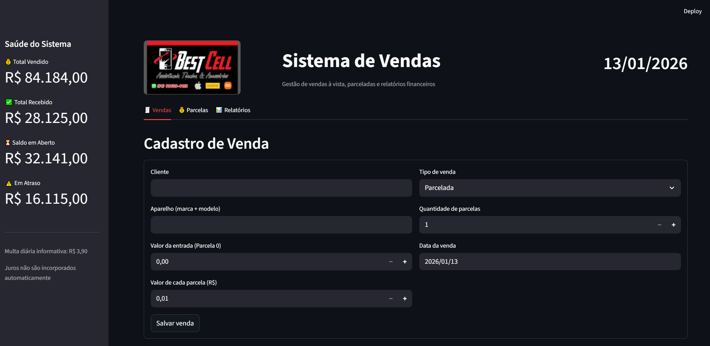
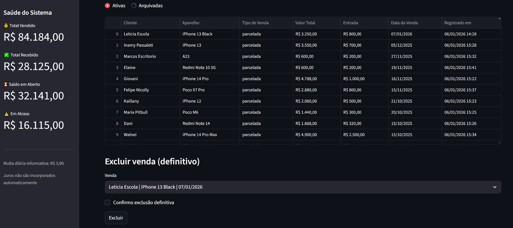
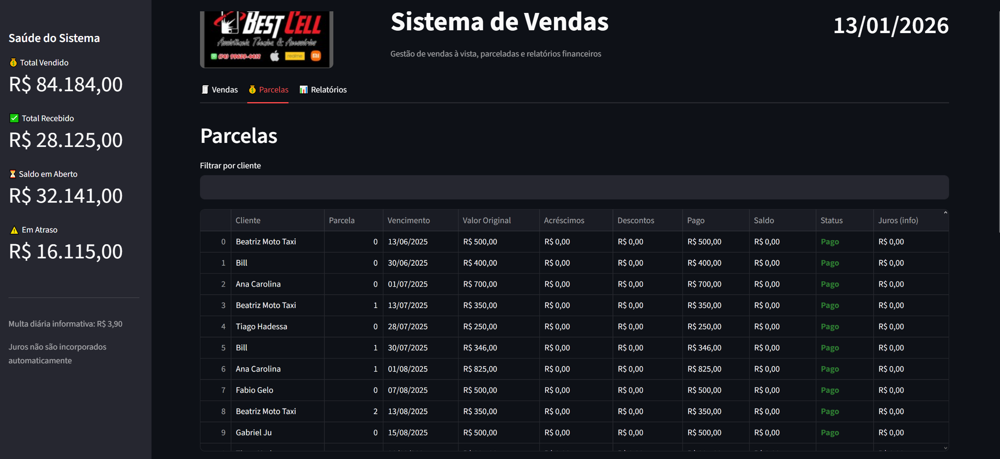
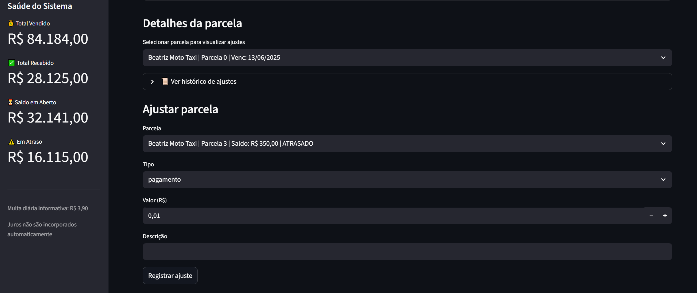
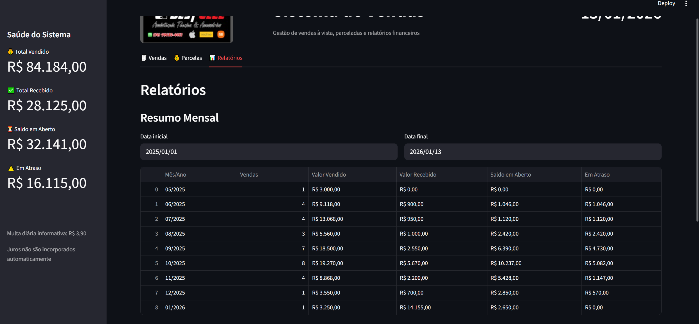
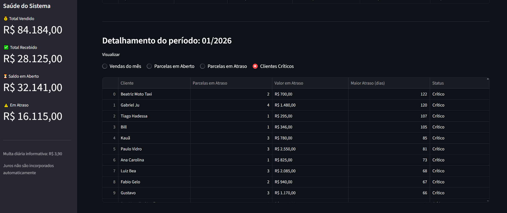

# 📱 Sistema Bestcell

## 1. Visão Geral do Sistema

O **Sistema Bestcell** é uma aplicação local desenvolvida para **gestão de vendas e controle financeiro**, com foco em vendas **à vista** e **parceladas**, amplamente aplicável a pequenos comércios, especialmente no segmento de aparelhos eletrônicos.

O sistema permite:

- Cadastro e acompanhamento de vendas
- Controle detalhado de parcelas e pagamentos
- Registro de acréscimos e descontos
- Identificação de inadimplência
- Geração de relatórios financeiros consolidados
- Encerramento administrativo de vendas críticas

O Bestcell foi projetado para **uso diário**, operando de forma **simples, segura e consistente**, priorizando a integridade financeira dos dados.  
Todo o processamento ocorre **localmente**, sem dependência de internet ou serviços externos.

A interface é acessada via navegador, utilizando o **Streamlit**, e o sistema pode ser iniciado com **duplo clique** por meio de um arquivo `.bat`.

---

## 2. Tecnologias Utilizadas

### Linguagem
- **Python 3**

### Interface
- **Streamlit**

### Manipulação e análise de dados
- **Pandas**

### Banco de dados
- **SQLite**

### Outras bibliotecas
- **python-dateutil**

Todas as dependências necessárias estão listadas no arquivo `requirements.txt`.

---

## 3. Arquitetura do Sistema

O Bestcell adota uma **arquitetura em camadas**, com separação clara de responsabilidades.

### Visão Geral

    Interface (Streamlit)
    │
    ▼
    Camada de View
    │
    ▼
    Camada de Negócio
    │
    ▼
    Camada de Persistência (SQLite)

### Camadas do Sistema

- **bestsystem.py** — Interface e orquestração
- **view.py** — Apresentação e formatação
- **utils.py** — Regras de negócio e cálculos
- **database.py** — Persistência de dados

---

## 4. Fluxo de Negócio

O fluxo de negócio representa o ciclo completo de uma venda.

### Venda à Vista
- Cadastro da venda
- Criação automática da parcela 0
- Pagamento integral
- Arquivamento automático

### Venda Parcelada
- Cadastro da venda
- Registro da entrada (parcela 0)
- Geração de parcelas futuras
- Gestão contínua até quitação ou encerramento

### Encerramento
- Quitação total → venda arquivada
- Exceção administrativa → venda encerrada

---

## 5. Funcionalidades do Sistema

### Gestão de Vendas
- Cadastro de vendas à vista e parceladas
- Arquivamento automático
- Exclusão de vendas

### Gestão de Parcelas
- Controle individual por parcela
- Status automático (Pago, Em dia, Atrasado)
- Cálculo dinâmico de saldo

### Ajustes Financeiros
- Pagamentos
- Acréscimos
- Descontos
- Histórico financeiro imutável

### Clientes Críticos
- Identificação automática
- Consolidação de inadimplência
- Encerramento administrativo

## 📸 Visão Geral do Sistema (Screenshots)

### 🧾 Cadastro de Vendas

---

### 📋 Vendas Ativas

---

### 💳 Controle de Parcelas

---

### ✏️ Ajustes de Parcelas

---

### 📊 Relatórios – Resumo Mensal

---

### 📈 Análise Detalhada (Drill-down)

---

## 6. Relatórios

O sistema oferece relatórios financeiros consolidados por período.

### Indicadores
- Valor total vendido
- Valor total recebido
- Saldo em aberto
- Valor em atraso

### Análise Detalhada
- Vendas do mês
- Parcelas em aberto
- Parcelas em atraso
- Clientes críticos

---

## 7. Como Executar o Sistema (Streamlit)

### Pré-requisitos
- Python 3.10+
- Windows
- Navegador web

### Estrutura de Diretórios

    Workspace/
        │    
        ├── .venv/    
        ├── run_bestsystem.bat    
        └── BestSystem/    
            ├── bestsystem.py      
            ├── database.py      
            ├── utils.py      
            ├── view.py      
            ├── bestsystem.db      
            └── assets/      
                └── logo.png

### Inicialização

Execute com duplo clique:
run_bestsystem.bat

Ou manualmente:
streamlit run BestSystem\bestsystem.py

O sistema será acessado em:
http://localhost:8501

---

## 8. Estrutura do Banco de Dados

### Tabelas principais

- **sales** — vendas
- **parcels** — parcelas
- **adjustments** — ajustes financeiros
- **archived_sales** — vendas quitadas
- **closed_sales** — vendas encerradas

O banco utiliza **SQLite** com integridade referencial ativa.

---

## 9. Considerações Finais

O Sistema Bestcell é um projeto **completo, funcional e pronto para uso diário**, desenvolvido com boas práticas de engenharia de software.

Atende tanto a um **cenário real de negócio** quanto a **avaliações acadêmicas**, servindo como um excelente item de portfólio.

### Possíveis evoluções
- Acesso remoto via VPS
- Banco PostgreSQL
- Login de usuário
- Backup automático
- API e frontend web

---

📌 **Projeto desenvolvido para fins práticos e uso cotidiano.**

